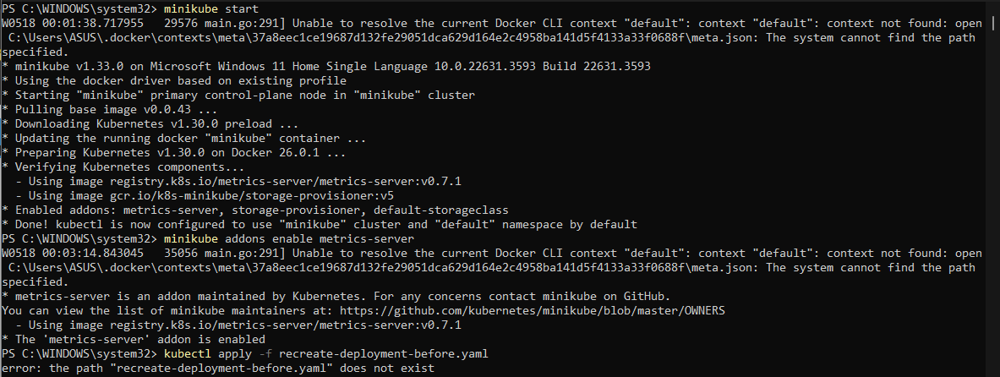
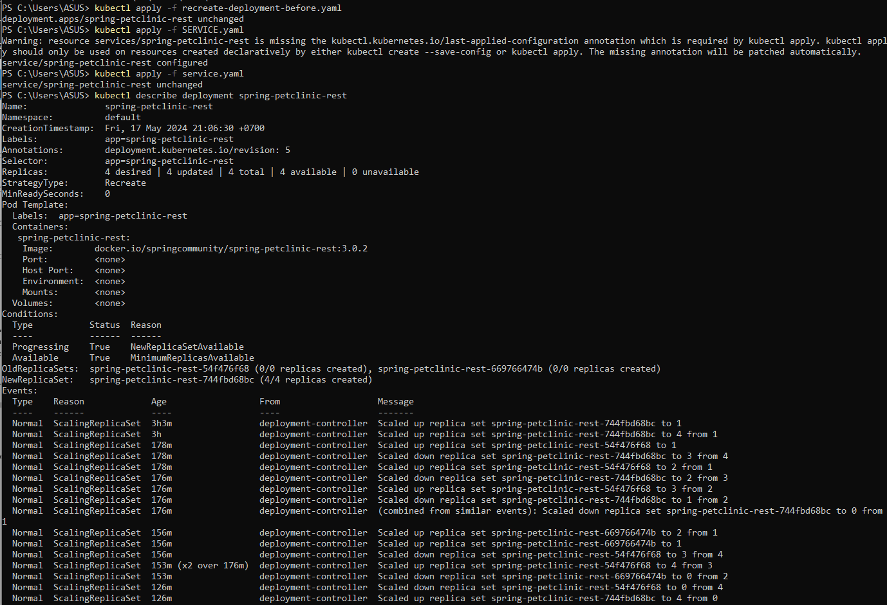
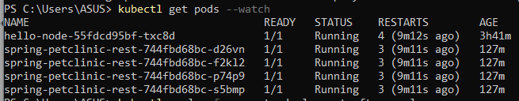

# Hello Minikube

### 1. Compare the application logs before and after you exposed it as a Service. Try to open the app several times while the proxy into the Service is running. What do you see in the logs? Does the number of logs increase each time you open the app?

> Sebelum mengekspos aplikasi sebagai service, kita mungkin hanya melihat log yang terkait dengan aplikasi itu sendiri yang berjalan di dalam kontainer Docker. Log ini bisa mencakup pesan startup, kesalahan atau peringatan yang muncul selama eksekusi, dan informasi relevan lainnya yang dihasilkan oleh aplikasi.

> Setelah mengekspos aplikasi sebagai service dan mengaksesnya melalui proxy yang berjalan di Minikube menggunakan kubectl, log kemungkinan akan menunjukkan aktivitas tambahan terkait komunikasi jaringan dan permintaan yang ditangani oleh service. Setiap kali aplikasi dibuka melalui proxy, jumlah log akan meningkat mencerminkan permintaan masuk, pemrosesan permintaan oleh service, dan respons yang dikirim kembali ke klien.

> Jumlah log memang akan meningkat setiap kali kita membuka aplikasi, karena setiap interaksi memicu aktivitas logging sebagai respons terhadap permintaan yang masuk dan pemrosesannya oleh service. Peningkatan jumlah log ini memberikan indikasi jelas tentang aktivitas service dan responsivitasnya terhadap permintaan klien.

### 2. Notice that there are two versions of `kubectl get` invocation during this tutorial section.The first does not have any option, while the latter has `-n` option with value set to `kube-system`. What is the purpose of the `-n` option and why did the output not list the pods/services that you explicitly created?

> Opsi -n dalam kubectl get digunakan untuk menentukan namespace di mana sumber daya akan didaftarkan. Namespace Kubernetes menyediakan cara untuk mempartisi sumber daya kluster secara logis dan memungkinkan beberapa pengguna atau tim untuk berbagi kluster yang sama tanpa saling mengganggu. Ketika tidak ada namespace yang ditentukan, kubectl biasanya default ke namespace default.

> Dalam tutorial, pemanggilan kubectl get pertama tidak menyertakan opsi -n, sehingga mencantumkan sumber daya dari namespace default, yang mungkin tidak termasuk sumber daya yang kita buat secara eksplisit jika kita membuatnya di namespace yang berbeda.

> Pemanggilan kubectl get kedua menyertakan opsi -n dengan nilai yang diatur ke kube-system, sehingga mencantumkan sumber daya secara spesifik dari namespace kube-system. Namespace ini biasanya berisi komponen sistem Kubernetes dan sumber daya terkait infrastruktur.

> Jika kita membuat pod dan service secara eksplisit di namespace yang berbeda, kita perlu menentukan namespace tersebut menggunakan opsi -n dalam kubectl get untuk melihat sumber daya tersebut dalam output. Misalnya:

```
kubectl get pods,services -n <namespace>
```

> Ganti <namespace> dengan nama namespace tempat kita membuat sumber daya. Ini akan mencantumkan pod dan service secara spesifik dari namespace tersebut. Jika kita membuat sumber daya di namespace default dan ingin melihatnya, kita bisa mengabaikan opsi -n, karena sumber daya dari namespace default dicantumkan secara default.

# Rolling Update Deployment

### 1. What is the difference between Rolling Update and Recreate deployment strategy?

> Rolling Update dan Recreate adalah dua strategi deployment yang berbeda di Kubernetes, masing-masing dengan karakteristik dan kegunaannya sendiri:

- **Rolling Update**:
  - **Strategi**: Rolling Update melakukan pembaruan secara bergilir pada pod dalam sebuah deployment. Ini menggantikan pod lama dengan yang baru secara bertahap, memastikan tidak ada downtime selama proses pembaruan.
  - **Proses**: Rolling Update menerapkan pod baru secara bertahap sambil mengurangi pod lama. Ini memantau kesehatan pod baru sebelum mengurangi pod lama, memastikan aplikasi tetap tersedia dan responsif selama pembaruan.
  - **Keuntungan**:
    - Zero downtime: Rolling Update memastikan aplikasi tetap tersedia bagi pengguna selama proses pembaruan.
   - Deployment terkontrol: Pembaruan diterapkan secara bertahap, memungkinkan pemantauan dan validasi pod baru sebelum sepenuhnya beralih ke versi baru.
  - **Kekurangan**:
    - Waktu deployment lebih lama: Rolling Update mungkin memerlukan waktu lebih lama untuk diselesaikan dibandingkan dengan Recreate, terutama untuk deployment besar, karena pembaruan diterapkan secara bertahap.

- **Recreate**:
  - **Strategi**: Recreate hanya menghentikan semua pod yang ada dan membuat pod baru dengan konfigurasi yang diperbarui. Ini secara efektif menghentikan versi lama aplikasi dan memulai versi baru sekaligus.
  - **Proses**: Recreate menghentikan semua pod yang ada dalam deployment sebelum membuat pod baru dengan konfigurasi yang diperbarui. Ini menghasilkan periode downtime singkat selama proses pembaruan.
  - **Keuntungan**:
    - Kesederhanaan: Recreate adalah strategi deployment yang sederhana yang menghentikan versi lama dan memulai versi baru, membuatnya mudah dipahami dan diterapkan.
    - Perilaku yang dapat diprediksi: Recreate memastikan aplikasi sepenuhnya diperbarui setelah proses deployment selesai.
  - **Kekurangan**:
    - Downtime: Recreate menghasilkan periode downtime singkat selama proses pembaruan, karena semua pod yang ada dihentikan sebelum yang baru dibuat.
    - Dampak potensial pada pengguna: Tergantung pada kebutuhan aplikasi, downtime selama pembaruan mungkin tidak dapat diterima untuk beberapa pengguna atau aplikasi.

Secara ringkas, Rolling Update lebih disukai untuk deployment yang memerlukan zero downtime dan pembaruan bertahap, sementara Recreate mungkin cocok untuk deployment yang lebih sederhana di mana downtime singkat dapat diterima atau ketika pembaruan perlu diterapkan dengan cepat dan dapat diprediksi.

### 2. Try deploying the Spring Petclinic REST using Recreate deployment strategy and document your attempt.






Berikut adalah langkah-langkah rinci untuk mendeply aplikasi Spring Petclinic REST di Minikube menggunakan strategi deployment Recreate:

1. **Mulai Minikube**:
    Mulai Minikube dengan perintah berikut:

    ```bash
    minikube start
    ```

    Perintah ini akan memulai kluster Kubernetes lokal menggunakan Minikube.

2. **Aktifkan Metrics Server**:
    Aktifkan addon Metrics Server untuk memungkinkan pemantauan penggunaan sumber daya:

    ```bash
    minikube addons enable metrics-server
    ```

    Perintah ini menginstal addon Metrics Server, yang mengumpulkan metrik sumber daya dari pod dan node di kluster.

3. **Terapkan `recreate-deployment-before.yaml`**:
    Terapkan `recreate-deployment-before.yaml` untuk membuat Deployment dengan perintah berikut:

    ```bash
    kubectl apply -f recreate-deployment-before.yaml
    ```

4. **Terapkan `service.yaml`**:
    Terapkan `service.yaml` untuk membuat Service yang mengekspos Deployment yang dibuat sebelumnya dengan perintah berikut:

    ```bash
    kubectl apply -f service.yaml
    ```

5. **Perbarui Deployment**:
    Perbarui Deployment untuk menggunakan versi terbaru dari `spring-petclinic-rest` menggunakan metode Deployment Recreate dengan menerapkan file serupa seperti `recreate-deployment-before.yaml` tetapi tag gambar diubah ke yang terbaru:

    ```bash
    kubectl apply -f recreate-deployment-after.yaml
    ```

### 3. Prepare different manifest files for executing Recreate deployment strategy.

Berikut adalah file manifest untuk mendeply aplikasi Spring Petclinic REST menggunakan strategi deployment Recreate:

1. **recreate-deployment-before.yaml**:

    ```yaml
    apiVersion: apps/v1
    kind: Deployment
    metadata:
        labels:
            app: spring-petclinic-rest
        name: spring-petclinic-rest
    spec:
        replicas: 4
        selector:
            matchLabels:
                app: spring-petclinic-rest
        strategy:
            type: Recreate
        template:
            metadata:
                labels:
                    app: spring-petclinic-rest
            spec:
                containers:
                - image: docker.io/springcommunity/spring-petclinic-rest:3.0.2
                  name: spring-petclinic-rest
    ```

2. **service.yaml**:

    ```yaml
    apiVersion: v1
    kind: Service
    metadata:
      labels:
        app: spring-petclinic-rest
      name: spring-petclinic-rest
    spec:
      ports:
      - nodePort: 32697
        port: 9966
        protocol: TCP
        targetPort: 9966
      selector:
        app: spring-petclinic-rest
      type: LoadBalancer
    ```

3. **recreate-deployment-after.yaml**:

    ```yaml
    apiVersion: apps/v1
    kind: Deployment
    metadata:
        labels:
            app: spring-petclinic-rest
        name: spring-petclinic-rest
    spec:
        replicas: 4
        selector:
            matchLabels:
                app: spring-petclinic-rest
        strategy:
            type: Recreate
        template:
            metadata:
                labels:
                    app: spring-petclinic-rest
            spec:
                containers:
                - image: docker.io/springcommunity/spring-petclinic-rest:latest
                  name: spring-petclinic-rest
    ```

> File-file manifest ini mendefinisikan sumber daya Deployment dengan nama `spring-petclinic-rest` dan sumber daya Service dengan nama yang sama. Sumber daya Deployment menentukan strategi deployment Recreate, yang membuat ulang semua pod ketika pembaruan diterapkan. Sumber daya Service mengekspos aplikasi pada port 9966 menggunakan layanan tipe LoadBalancer.

> File-file ini dapat diterapkan menggunakan perintah `kubectl apply -f <filename.yaml>`. Sesuaikan versi gambar atau parameter lain sesuai kebutuhan setup spesifik.

### 4. What do you think are the benefits of using Kubernetes manifest files? Recall your experience in deploying the app manually and compare it to your experience when deploying the same app by applying the manifest files (i.e., invoking `kubectl apply-f` command) to the cluster.

> Menggunakan file manifest Kubernetes memberikan beberapa manfaat:

> 1. **Infrastruktur sebagai Kode (IaC)**: File manifest memungkinkan kita mendefinisikan infrastruktur aplikasi secara deklaratif menggunakan kode. Ini memudahkan pengendalian versi, pelacakan perubahan, dan pengelolaan konfigurasi infrastruktur bersama dengan kode aplikasi.
> 2. **Reproduksibilitas**: File manifest memastikan bahwa deployment konsisten di seluruh lingkungan. Dengan mendefinisikan keadaan yang diinginkan dari aplikasi dalam kode, kita dapat dengan mudah mereproduksi deployment di lingkungan yang berbeda, mengurangi risiko penyimpangan konfigurasi.
> 3. **Otomatisasi**: File manifest Kubernetes dapat diotomatisasi menggunakan pipeline integrasi dan pengiriman berkelanjutan (CI/CD). Ini memungkinkan otomatisasi proses deployment, mengurangi intervensi manual dan potensi kesalahan.
> 4. **Visibilitas dan Transparansi**: File manifest memberikan pandangan yang jelas dan transparan tentang konfigurasi aplikasi. Kita dapat dengan mudah melihat keadaan yang diinginkan dari aplikasi dan melacak perubahan dari waktu ke waktu.
> 5. **Operasi Idempoten**: Menerapkan file manifest menggunakan perintah `kubectl apply -f` memastikan operasi idempoten. Kubernetes menyelaraskan keadaan yang diinginkan yang didefinisikan dalam file manifest dengan keadaan saat ini dari kluster, memastikan bahwa hanya perubahan yang diperlukan yang diterapkan.

> Membandingkan pengalaman mendeply aplikasi secara manual dengan menggunakan file manifest, mendeply dengan file manifest menawarkan:

> - **Konsistensi**: Dengan file manifest, deployment konsisten dan dapat direproduksi di berbagai lingkungan. Deployment manual dapat menyebabkan perbedaan antara lingkungan karena kesalahan manusia atau perbedaan dalam pelaksanaan.
> - **Efisiensi**: Menggunakan file manifest menyederhanakan proses deployment, karena kita dapat mendefinisikan semua konfigurasi dalam kode dan menerapkannya ke kluster dengan satu perintah. Ini mengurangi waktu dan upaya yang dibutuhkan untuk deployment dibandingkan dengan langkah manual.
> - **Kontrol Versi**: File manifest dapat dikendalikan versi menggunakan Git atau sistem kontrol versi lainnya. Ini memungkinkan kita melacak perubahan, mengembalikan konfigurasi sebelumnya jika diperlukan, dan berkolaborasi dengan anggota tim lebih efektif.

> Secara keseluruhan, menggunakan file manifest Kubernetes meningkatkan proses deployment dengan menyediakan pendekatan yang terstandarisasi, otomatis, dan dikendalikan versi untuk mengelola infrastruktur
